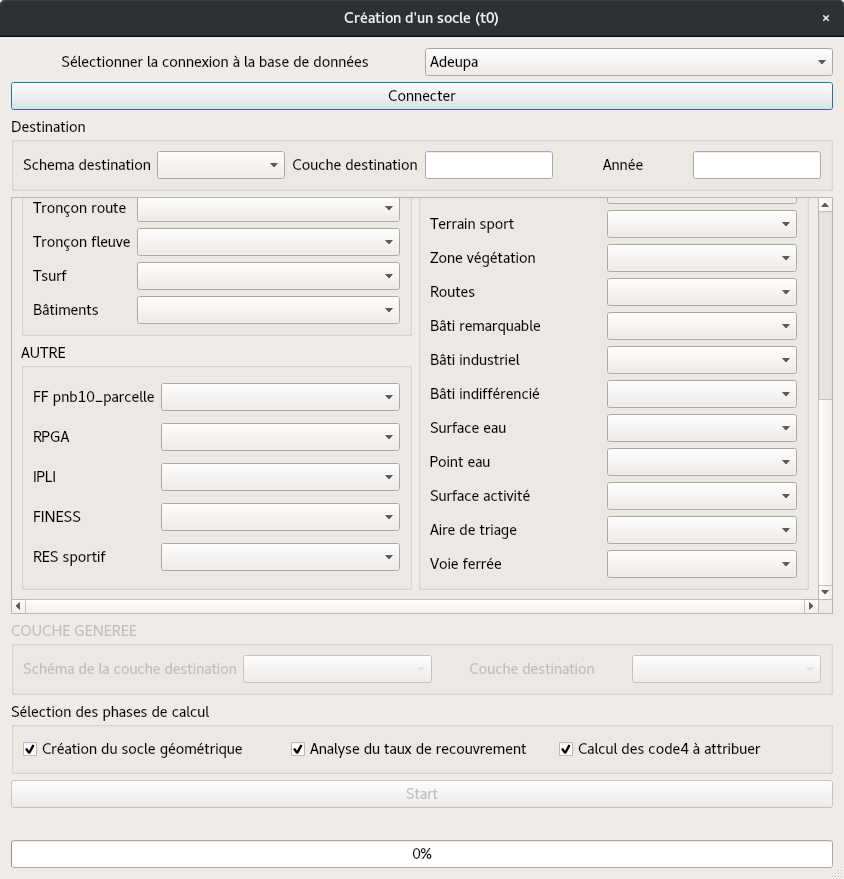

# PLUGIN Adeupa-MOS - Génération de socle MOS

***
**QGIS Minimum Version : 3.0**

**Dépot de plugin : `http://qgis.sirs-fr.com/qgis_repo_openig/plugins.xml`**

***

## Ajouter le dépôt de plugin

Configurer les dépôts supplémentaires :

- Placez vous sur l’onglet __*Paramètres*__ dans la fenêtre __*Gestionnaire d’extensions*__ :

- Cliquer sur __*Ajouter...*__ pour trouver et ajouter un nouveau dépôt.

- Fournir un nom et une URL pour le nouveau dépôt et s'assurer que la case __*Activé*__ est cochée.

- Vous devriez voir maintenant le nouveau dépôt listé dans la liste des dépôts d’extension configurés :

- Vous pouvez également sélectionner l’option pour afficher les extensions expérimentales en cochant la case __*Afficher les extensions expérimentales*__.

- Si vous revenez sur l’onglet __*Non installées*__, vous verrez que des extensions supplémentaires sont disponibles à l’installation.

- Pour installer une extension, cliquez simplement dessus dans la liste puis cliquez sur le bouton __*Installer l’extension*__.

## Prérequis

- **Champs** des couches en **minuscule**
- Nom de la colonne de géométrie : **geom**
- Nom de la colonne clé primaire : **gid**
- Importer les couches dans une **base de données postgres**
- Créer une **connexion** à la **base de données** dans **QGIS**
- Données IGN
- Cadastre edigeo
- Données exogènes:
  - IPLI
  - RPGA
  - Fichiers fonciers
  - FINESS
  - RES sport

## <a id="up"> Sommaire </a>
* [Création de socle](#-module-1-)
  * [Socle géométrique](#-module-1-)
  * [Correspondance de recouvrement](#-module-1-)
  * [Attribution des codes](#-module-1-)

***
## <a id="mod1"> Création de socle </a>

La création de socle utilise différentes données sur un territoire pour créer un ensemble de géométrie recouvrant le territoire.
Ce module s'opère en trois étapes :
  - Création géométrique du socle : Mise en correspondance des données géométrique pour unifier l'ensemble de la zone à recouvrir.
  - Information des parcelles par taux de recouvrement
  - Attribution des code de nomenclature suivant un ensemble de règles.

Les étapes peuvent être lancées une à une (dans l'ordre) ou en une fois.
Pour lancer les calculs, il suffit de remplir les différentes données se trouvant dans la base de données.
Pour les données de l'IGN il est possible de préciser le champ de géométrie : __*geom*__ ou __*the_geom*__, le champ 'the_geom' étant toujours utilisé dans les import de données IGN.

#### <a id="mod1"> Socle géométrique </a>
La création du socle géométrique nécessite les données suivantes :
  - Communes  __- BD Topo__
  - Communes  __- BD Parcellaire__
  - Sections  __- Edigeo__
  - Parcelles  __- Edigeo__
  - Subdivision  __- Edigeo__
  - RPGA
  - IPLI
  - Routes __- IGN__
  - Zone végétation __- IGN__

La couche résultante se trouve dans le schéma **public** de la base de données et se nomme **socle_temp_geom**

#### <a id="mod1"> Correspondances de recouvrement </a>
La correspondance de recouvrement utilise toutes les données pour attribuer un pourcentage de présence sur la parcelle générée par le socle géométrique. Une intersection entre le socle géométrique et la données référence est opéré pour identifier au mieux les valeurs possibles pour les parcelles de la couche. En fonction des résultats de ces intersection, la table attributaire se remplie en attribuant un pourcentage de présence.

Les données nécessaire sont les suivantes:
  - Communes  __- BD Topo__
  - Communes __- BD Parcellaire__
  - Sections __- Edigeo__
  - Parcelles __- Edigeo__
  - Subdivision __- Edigeo__
  - Tronçon route __- Edigeo__
  - Tronçon fleuve __- Edigeo__
  - Tsurf __- Edigeo__
  - Bâtiments __- Edigeo__
  - Fichiers __- fonciers__
  - RPGA
  - IPLI
  - FINESS
  - RES sport
  - PAI culture et loisir __- IGN__
  - PAI transport __- IGN__
  - PAI santé __- IGN__
  - PAI religieux __- IGN__
  - PAI administratif militaire __- IGN__
  - PAI science enseignement __- IGN__
  - PAI industrie commercial __- IGN__
  - PAI sport __- IGN__
  - Poste transformation __- IGN__
  - Cimetière __- IGN__
  - Terrain de sport __- IGN__
  - Zone de végétation __- IGN__
  - Routes __- IGN__
  - Bâtiments remarquable __- IGN__
  - Bâtiments industriel __- IGN__
  - Bâtiments indifférencié __- IGN__
  - Surface en eau __- IGN__
  - Point d'eau __- IGN__
  - Surface d'activité __- IGN__
  - Aire de triage __- IGN__
  - Voie ferré __- IGN__

Il est aussi nécessaire de renseigner le schéma et le nom de la couche de destination pour qu'une nouvelle couche soit créée.

#### <a id="mod1"> Attribution des codes </a>
L'attribution des codes se fait en fonction des résultats de l'action précédente et une suite de test avec des degrés d'importance.
Le résultat est la couche passé en paramètre en y attribuant les codes correspondants entre la nomenclature et la présence détecté sur la parcelle.

Les données nécessaire sont les suivantes:
  - Couche résultante de l'opération précédente
